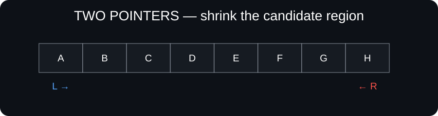
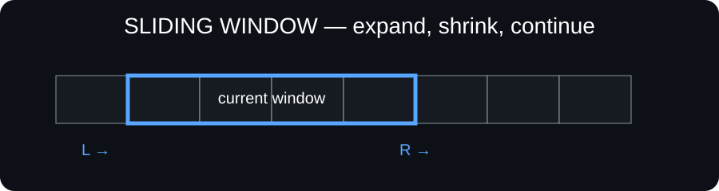
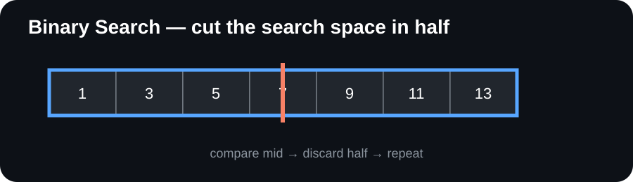
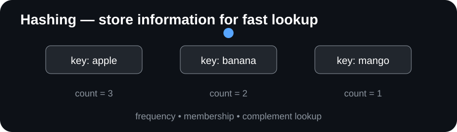
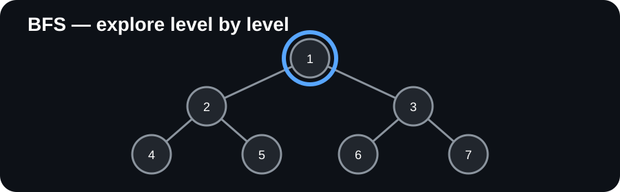
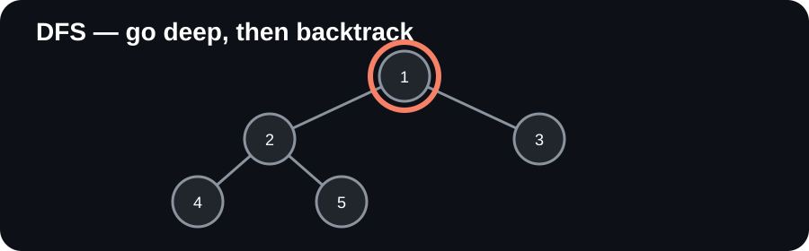

# DSA Patterns & Problem-Solving Guide

A practical, visual-first guide for learning Data Structures & Algorithms by recognizing patterns instead of memorizing isolated solutions.

The structure is informed by *Data Structures and Algorithm Analysis in C++ (Fourth Edition)* by Mark Allen Weiss. The book is used as a coverage reference; the explanations, examples, diagrams, templates, and checklists here are original.

## Goal

**Problem → Constraints → Signals → Pattern → Invariant → Algorithm → Code → Complexity → Edge cases**

## Source coverage

The source book covers algorithm analysis, lists/stacks/queues, trees, hashing, heaps, sorting, disjoint sets, graph algorithms, and algorithm-design techniques. This repository converts that broad coverage into an interview-oriented pattern map.

| Source area | Guide area |
|---|---|
| Algorithm analysis | Complexity & mathematical reasoning |
| Lists, stacks, queues | Linear structures |
| Trees | Traversal, BST, recursion |
| Hashing | Frequency, lookup, complement |
| Priority queues / heaps | Top-K, scheduling, greedy |
| Sorting | Ordering, partitioning |
| Disjoint sets | Union-Find |
| Graph algorithms | BFS, DFS, shortest path, MST, topo sort |
| Algorithm design | Greedy, divide & conquer, DP, backtracking |

## Pattern index

- Two Pointers
- Sliding Window
- Prefix Sum
- Difference Array
- Hashing / Frequency
- Binary Search
- Fast & Slow Pointers
- Linked-List Reversal
- Stack / Monotonic Stack
- Queue / BFS
- Tree DFS / BFS
- Heap / Priority Queue
- Sorting + Greedy
- Greedy
- Divide & Conquer
- Backtracking
- Dynamic Programming
- Graph DFS / BFS
- Topological Sort
- Shortest Path
- Minimum Spanning Tree
- Disjoint Set Union

## Recommended learning order

**Foundations → Arrays & Hashing → Two Pointers → Sliding Window → Prefix/Difference → Binary Search → Strings → Linked Lists → Stack/Queue → Trees → Heaps → Graphs → Greedy → Backtracking → Dynamic Programming → Advanced**

## How to use each pattern

For every pattern, ask:

1. What signal in the statement suggests it?
2. What state must be maintained?
3. What invariant stays true?
4. What changes on each step?
5. Why can discarded candidates never become useful?
6. What are time and space costs?
7. What edge cases break a naive implementation?

## Repository map

- 01-Foundations
- 02-Arrays
- 03-Strings
- 04-Linked-Lists
- 05-Stack-Queue
- 06-Binary-Search
- 07-Trees
- 08-Heaps
- 09-Graphs
- 10-Greedy
- 11-Backtracking
- 12-Dynamic-Programming
- 13-Advanced
- problem-pattern-map

## C++ convention

Templates use compact C++17 and focus on algorithmic reasoning.

~~~cpp
class Solution {
public:
    int solve(vector<int>& nums) {
        // pattern logic
    }
};
~~~

## Important

This is an original study guide, not a reproduction of the source textbook. Do not copy textbook pages, figures, exercises, or long passages into this repository.

## Practice rule

A pattern is strong only when you can explain why it applies, write the template, dry-run a new example, state the invariant, analyze complexity, and identify when it should not be used.

## 🖼️ Visual pattern cards

### Two Pointers

### Sliding Window

## 📌 Source note

Coverage was checked against the supplied DataStructures.pdf. The source text explicitly covers lists/stacks/queues, hashing, priority queues, sorting, disjoint sets, graph algorithms, and algorithm-design techniques. This repository rewrites those topics into original study notes and practice-oriented pattern explanations.

## 🎬 Animated pattern explanations

These lightweight animated SVGs show the movement/state change instead of only describing it in text.

### Two Pointers

### Sliding Window

### Binary Search

### Hashing

### BFS

### DFS / Backtracking

> **Visual-first rule:** each animation is meant to answer *“what is moving/changing, and why?”* before you write the code.
