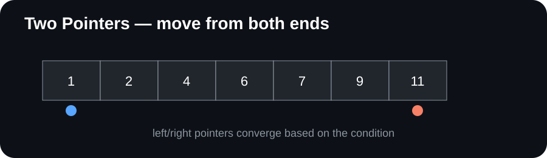

# DSA Patterns & Problem-Solving Guide

  <strong>Learn DSA by recognizing patterns — not memorizing solutions.</strong>

  
  
  

  

---

## About

**DSA Patterns & Problem-Solving Guide** is a visual-first, interview-oriented study repository for learning Data Structures & Algorithms through **pattern recognition, invariants, visual explanations, C++ templates, and practice guidance**.

Instead of treating every coding problem as a completely new puzzle, the guide trains a repeatable workflow:

> **Problem → Constraints → Signals → Pattern → Invariant → Algorithm → Code → Complexity → Edge Cases**

The repository is designed to complement problem-solving practice, not replace it.

## ✨ What this repository provides

| Resource | Purpose |
|---|---|
| 🧩 **Pattern notes** | Understand recurring DSA techniques and when to use them |
| 🧠 **Recognition clues** | Identify patterns from constraints and problem wording |
| 🎬 **Animated explanations** | Visualize pointer movement, search-space reduction and traversal |
| 🖼️ **Visual cards** | Quick-reference diagrams for important patterns |
| 💻 **C++17 templates** | Start implementation from a reusable structure |
| 🔍 **Invariants & reasoning** | Understand *why* an algorithm works |
| ⏱️ **Complexity analysis** | Track time and space trade-offs |
| 🎥 **Video resources** | Optional external explanations mapped to topics |
| 🗺️ **Problem-pattern map** | Connect problem types to useful patterns |
| 📚 **Source coverage map** | Map broad DSA areas to this guide |

## 🧭 Core learning workflow

~~~text
Read the pattern
      ↓
Understand the signal
      ↓
Watch the visual
      ↓
Study the C++ template
      ↓
Dry-run an example
      ↓
Solve independently
      ↓
Analyze complexity + edge cases
      ↓
Solve a new problem
~~~

### The rule

**Do not memorize the code first.**

Before implementing, be able to answer:

1. What signal tells me this pattern may apply?
2. What state am I maintaining?
3. What invariant remains true?
4. What changes on each iteration?
5. Why can a candidate be discarded?
6. What are the time and space costs?
7. When should I *not* use this pattern?

## 📚 Pattern index

### Foundations
- Complexity analysis
- Mathematical reasoning
- Recursion

### Arrays & Hashing
- Two Pointers
- Sliding Window
- Prefix Sum
- Difference Array
- Kadane's Algorithm
- Hashing / Frequency Maps

### Linear Data Structures
- Fast & Slow Pointers
- Linked-List Reversal
- Stack
- Monotonic Stack
- Queue
- BFS

### Searching
- Binary Search
- Binary Search on Answer

### Trees & Heaps
- Tree DFS
- Tree BFS
- BST patterns
- Heap / Priority Queue
- Top-K

### Graphs
- Graph DFS / BFS
- Topological Sort
- Shortest Path
- Minimum Spanning Tree
- Disjoint Set Union

### Algorithm Design
- Greedy
- Divide & Conquer
- Backtracking
- Dynamic Programming
- Sorting

## 🗂️ Repository structure

~~~text
DSA-Patterns-Solving-Guide/
├── 01-Foundations/
├── 02-Arrays/
├── 03-Strings/
├── 04-Linked-Lists/
├── 05-Stack-Queue/
├── 06-Binary-Search/
├── 07-Trees/
├── 08-Heaps/
├── 09-Graphs/
├── 10-Greedy/
├── 11-Backtracking/
├── 12-Dynamic-Programming/
├── 13-Advanced/
├── images/
├── problem-pattern-map/
├── CONTRIBUTING.md
├── VIDEO-RESOURCES.md
└── README.md
~~~

## 🗺️ Recommended learning order

**Foundations → Arrays & Hashing → Two Pointers → Sliding Window → Prefix/Difference → Binary Search → Strings → Linked Lists → Stack/Queue → Trees → Heaps → Graphs → Greedy → Backtracking → Dynamic Programming → Advanced**

This is a learning path, not a rigid requirement. Move ahead when you can explain and implement the current pattern independently.

## 🎬 Animated pattern explanations

Lightweight animated SVGs visualize the important state changes.

| Pattern | Visual |
|---|---|
| Two Pointers | [Animated explanation](./images/two-pointers-animated.svg) |
| Sliding Window | [Animated explanation](./images/sliding-window-animated.svg) |
| Binary Search | [Animated explanation](./images/binary-search-animated.svg) |
| Hashing | [Animated explanation](./images/hashmap-animated.svg) |
| BFS | [Animated explanation](./images/bfs-animated.svg) |
| DFS / Backtracking | [Animated explanation](./images/dfs-animated.svg) |

> **Visual-first principle:** understand *what is moving or changing and why* before writing the implementation.

## 🎥 Video learning resources

Each major topic is paired with optional external learning resources.

**[→ Open the complete Video Resources Guide](./VIDEO-RESOURCES.md)**

Resources include **NeetCode, take U forward (Striver), Abdul Bari, Aditya Verma, and WilliamFiset**, mapped to relevant DSA topics.

Recommended workflow:

> **Notes → Animation → Video if needed → Template → Independent implementation → Problems**

Do not turn the repository into a passive video-watching checklist. The goal is independent problem solving.

## 💻 C++17 convention

Examples use compact C++17 and emphasize algorithmic reasoning.

~~~cpp
class Solution {
public:
    int solve(vector<int>& nums) {
        // pattern logic
    }
};
~~~

## 🎓 Engineering DAA → Interview Coverage

This guide also includes a consolidated map connecting the **five-unit engineering DAA/DSA foundation** to interview-oriented patterns and SDE preparation.

**[→ Open the Engineering DAA / FAANG Coverage Map](./ENGINEERING-DAA-FAANG-COVERAGE-MAP.md)**

It distinguishes **conceptual syllabus coverage** from the additional **pattern recognition, implementation, debugging, and independent problem-solving practice** required for technical interviews.

## 📖 Source coverage

The structure of this guide is informed by **Data Structures and Algorithm Analysis in C++ (Fourth Edition)** by Mark Allen Weiss.

The source is used as a **coverage reference**. This repository independently rewrites the material into pattern-oriented study notes, diagrams, templates, and checklists.

| Source area | Guide area |
|---|---|
| Algorithm analysis | Complexity & mathematical reasoning |
| Lists, stacks, queues | Linear structures |
| Trees | Traversal, BST, recursion |
| Hashing | Frequency, lookup, complement |
| Priority queues / heaps | Top-K, scheduling, greedy |
| Sorting | Ordering and partitioning |
| Disjoint sets | Union-Find |
| Graph algorithms | BFS, DFS, shortest path, MST, topological sort |
| Algorithm design | Greedy, divide & conquer, DP, backtracking |

## ⚠️ Copyright & source-use note

This repository is an **original study guide**, not a reproduction of the source textbook.

It does not intentionally reproduce textbook pages, figures, exercises, or long passages. Explanations, examples, diagrams, templates, and checklists are written for this repository.

## 🤝 Contributing

Contributions are welcome.

Good contributions include:
- clearer pattern explanations
- better visualizations
- additional recognition clues
- edge cases and common mistakes
- original C++ examples
- problem-to-pattern mappings
- corrections and documentation improvements

Please read **[CONTRIBUTING.md](./CONTRIBUTING.md)** before opening a pull request.

## ⭐ Support the project

If this guide helps you learn DSA, consider giving the repository a ⭐ on GitHub.

It helps the project become easier for other learners to discover.

## 📌 Study philosophy

> **The goal is not to remember 500 solutions.**
>
> **The goal is to recognize the underlying pattern and derive the solution.**

A strong DSA learner should gradually move from:

~~~text
"What solution did I see?"
        ↓
"What pattern is this?"
        ↓
"What invariant can I maintain?"
        ↓
"Can I derive the algorithm?"
        ↓
"Can I implement it without the template?"
~~~

  Built as an open-source learning resource for structured DSA practice.

